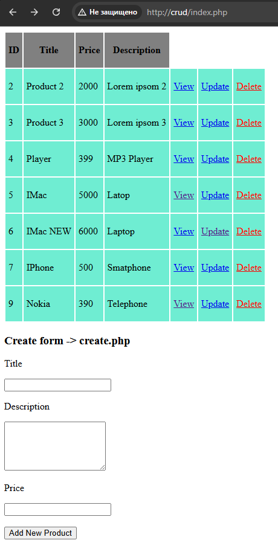

# Learn PHP + SQL + CRUD

## Источник информации видео "" канала "": 
### Описание: 
В этом проекте демонстрируется использование PHP в связке с MySQL по методологии CRUD.
Опирации создания, вывод, измененияи удаления записей. 
Это позволяет понять, как можно взаимодействовать с базой данных на примере PHP.

1. 
2. 
3. 

#### Как длеать связь таблиц в PhpMyAdmin:
